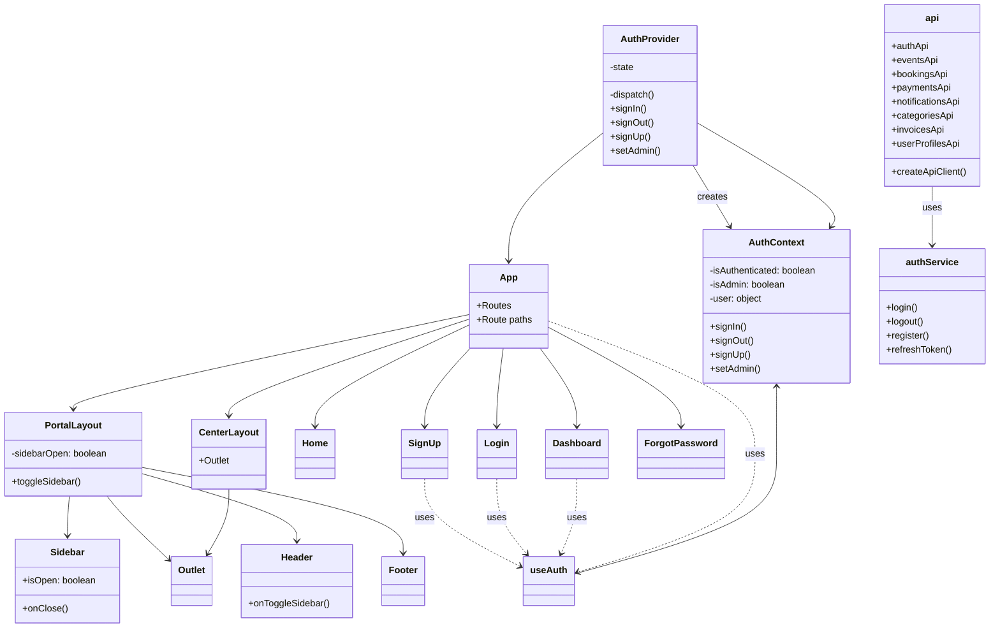
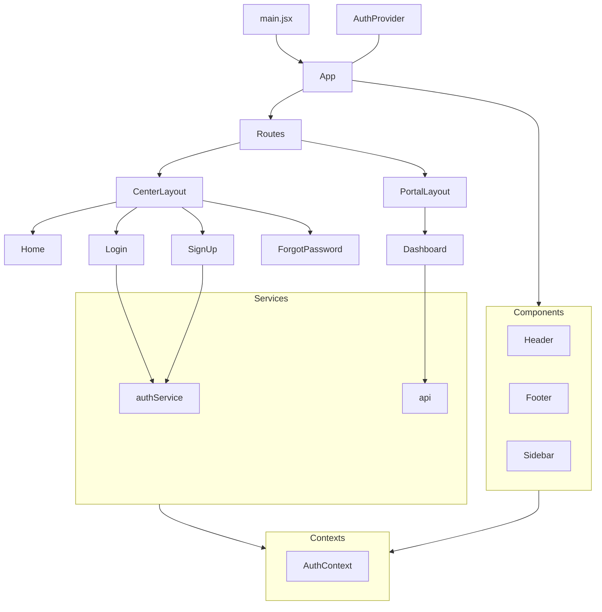
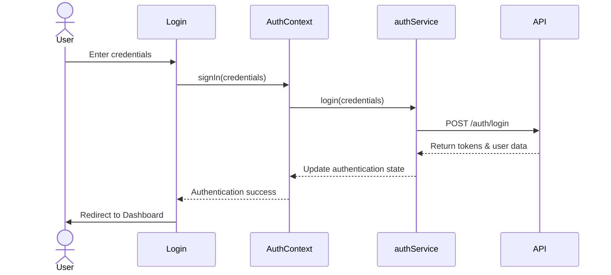

# Frontend Application UML Diagram

```mermaid
classDiagram
    %% Main Application Structure
    App --> CenterLayout
    App --> PortalLayout
    App --> Home
    App --> Dashboard
    App --> Login
    App --> SignUp
    App --> ForgotPassword

    %% Layout Components
    CenterLayout --> Outlet
    PortalLayout --> Sidebar
    PortalLayout --> Header
    PortalLayout --> Footer
    PortalLayout --> Outlet

    %% Context Providers
    AuthProvider --> App
    AuthContext <-- useAuth
    AuthProvider --> AuthContext

    %% Service Layer
    class api {
        +createApiClient()
        +authApi
        +eventsApi
        +bookingsApi
        +paymentsApi
        +notificationsApi
        +categoriesApi
        +invoicesApi
        +userProfilesApi
    }

    class authService {
        +login()
        +logout()
        +register()
        +refreshToken()
    }

    %% Main Components
    class App {
        +Routes
        +Route paths
    }

    class AuthContext {
        -isAuthenticated: boolean
        -isAdmin: boolean
        -user: object
        +signIn()
        +signOut()
        +signUp()
        +setAdmin()
    }

    class AuthProvider {
        -state
        -dispatch()
        +signIn()
        +signOut()
        +signUp()
        +setAdmin()
    }

    class CenterLayout {
        +Outlet
    }

    class PortalLayout {
        -sidebarOpen: boolean
        +toggleSidebar()
    }

    class Header {
        +onToggleSidebar()
    }

    class Sidebar {
        +isOpen: boolean
        +onClose()
    }

    class Footer {
    }

    %% Pages
    class Home {
    }

    class Dashboard {
    }

    class Login {
    }

    class SignUp {
    }

    class ForgotPassword {
    }

    %% Relationships
    AuthProvider --> AuthContext : creates
    api --> authService : uses
    App ..> useAuth : uses
    Dashboard ..> useAuth : uses
    Login ..> useAuth : uses
    SignUp ..> useAuth : uses
```

## Component Relationships

```mermaid
flowchart TD
    main[main.jsx] --> App
    App --> Routes

    Routes --> CenterLayout
    Routes --> PortalLayout

    CenterLayout --> Home
    CenterLayout --> Login
    CenterLayout --> SignUp
    CenterLayout --> ForgotPassword

    PortalLayout --> Dashboard

    AuthProvider --- App

    subgraph Services
        authService
        api
    end

    subgraph Components
        Header
        Footer
        Sidebar
    end

    subgraph Contexts
        AuthContext
    end

    Login --> authService
    SignUp --> authService
    Dashboard --> api
    App --> Components
    Components --> Contexts
    Services --> Contexts
```

## Data Flow

```mermaid
sequenceDiagram
    actor User
    participant Login
    participant AuthContext
    participant authService
    participant API

    User->>Login: Enter credentials
    Login->>AuthContext: signIn(credentials)
    AuthContext->>authService: login(credentials)
    authService->>API: POST /auth/login
    API-->>authService: Return tokens & user data
    authService-->>AuthContext: Update authentication state
    AuthContext-->>Login: Authentication success
    Login->>User: Redirect to Dashboard
```
